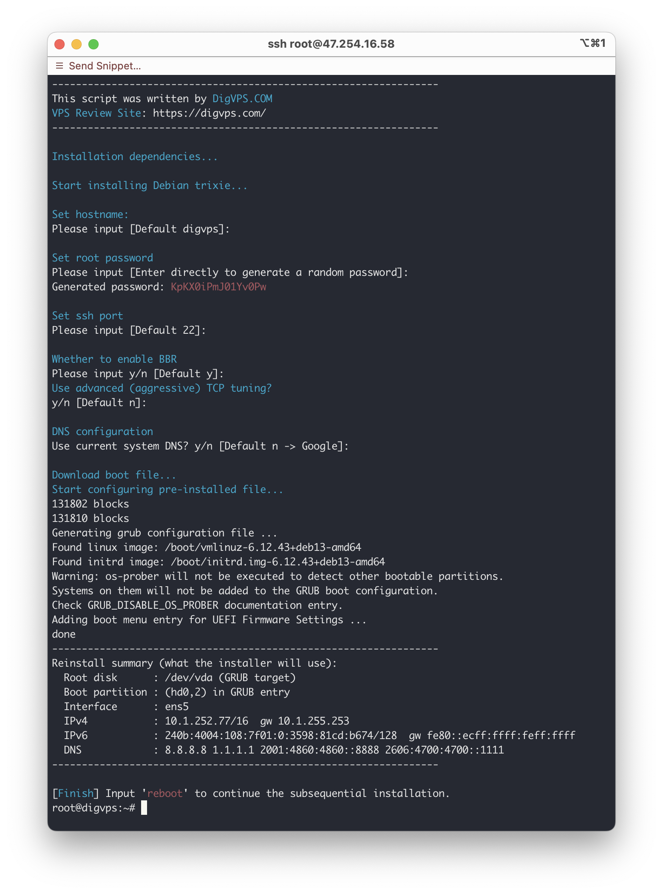

<div align="center">

# DigVPS-Debian-Reinstall


**A lightweight script for reinstalling your server with Debian 13**

</div>

---

⚠️ **Note:**  
This script only supports reinstalling the system to **Debian 13**, and requires the original system to be **Debian** or **Ubuntu**.  
Since we have not conducted extensive testing, there is a high probability that the reinstallation may fail.  
In theory, if the final installation summary shows correct disk and IP settings, the reinstallation is likely to succeed.

## 🚀 Usage

```shell
bash <(curl -sL https://github.com/bihell/DigVPS-Debian-Reinstall/raw/main/debian-dd.sh)
```

## 🔍 VPS Recommendation

Check out our VPS review site: **[DigVPS.COM](https://digvps.com/)**

## 📸 Screenshot


