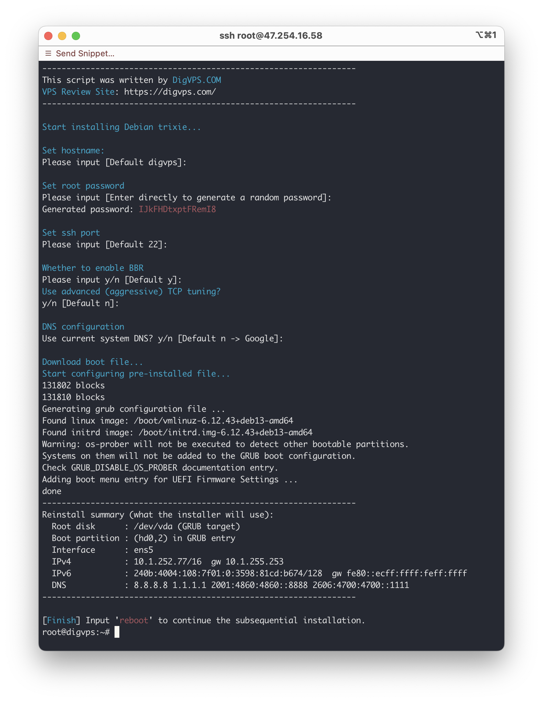

# Debian-DD

A Debian reinstallation script

This script only supports reinstalling the system to Debian 13, and it requires the original system to be either Debian or Ubuntu. 

In addition, we do not have the resources to perform extensive testing, so there is a high probability that the reinstallation may fail. In theory, if you see the final installation summary and the hard drive and IP configurations are correct, there is a good chance the reinstallation will succeed.

## 0x01 Usage

```
bash <(curl -sL https://github.com/bihell/debian-dd/raw/main/debian-dd.sh)
```

## 0x02 VPS Choose

My VPS Review Site [DigVPS.COM](https://digvps.com/)


## 0x03 ScreenShot


